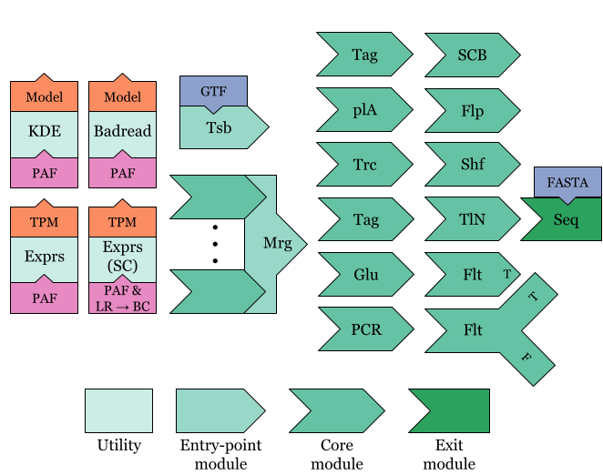

[](http://bioconda.github.io/recipes/tksm/README.html)

# TKSM
TKSM (Turkish: [*Taksim*](https://en.wiktionary.org/wiki/taksim), Arabic: [*تقسيم*](https://en.wiktionary.org/wiki/%D8%AA%D9%82%D8%B3%D9%8A%D9%85), both meaning *to divide*) is a modular software for simulating long-read sequencing.
Each module is meant to simulate a specific step in the sequencing process.
The modules are designed to be piped together to form a pipeline which is specified in the configuration file.
The pipelines are executed using Snakemake.

If you are interested in the paper results, please check out the [paper branch](https://github.com/vpc-ccg/tksm/tree/paper).

## Installation

### Conda (only available for Linux at the moment.)
The easiest installation method is to use [Conda](https://docs.conda.io/projects/conda/en/latest/user-guide/install/linux.html) or, much prefereblally, [Mamba](https://github.com/conda-forge/miniforge#mambaforge).
If you are using Conda, replace `mamba` with `conda` in the following commands.

Run:
```bash
mamba install -c bioconda tksm
```

### Source
To install from source, you need to have to fulfill the dependencies of TKSM.
This can be done using Mamba (or Conda) by running:

```bash
mamba create -f env.yml
mamba activate tksm
```

You may also need to install all the packages listed in the `env.yml` file manually (not recommended).

Then, you can install TKSM by running:
```bash
INSTALL_PREFIX="<install_prefix>" make -j <threads>
./install.sh
```
Where `<install_prefix>` is the path to the directory where you want to install TKSM.
For example, if you want to install TKSM in `/usr/bin`, you should run:

```bash
INSTALL_PREFIX="/usr" make -j <threads>
./install.sh
```

The `install.sh` script will copy the TKSM executable and some predefined models to the `bin` directory under the `INSTALL_PREFIX` directory.

## Quick testing
Install TKSM from source and run the following commands to test the installation:

```bash
wget https://figshare.com/ndownloader/files/43059307 -O tksm-test-data.tar.gz
tar -zvxf tksm-test-data.tar.gz
snakemake --configfile config-test.yaml -j32
```

## Running using Snakemake
Snakemake assumes that TKSM is installed in your `$PATH` and can be run by simply calling `tksm`.
You can modify the `exec` parameter in the `config.yaml` file to specify the path to the TKSM executable.

The minimum version of Snakemake required is `6v`.
To specify a simulation pipeline, modify the `config.yaml` file.

## TKSM documentation
TKSM has a number of of implemented modules.
There are four types of modules: entry-point modules, core modules, utility modules, and the exit module.

- Entry-point modules are the modules that are used to start a simulation pipeline. They generate files in the MDF format ([see below](#mdf-format)).
- Core modules are the modules that modify the molecules. They take MDF files as input and generate MDF files as output.
- Utility modules are the modules generate models that are used by specific modules (e.g. TPM for isoforms that is used by the Transcriber module).
- Exit module is the module that generates the final output of the simulation pipeline. It takes MDF files as input and generates FASTA/A files as output.




|Type     | Name     | Description                                                 |
|-        | -        | -                                                           |
| Utility | `Exprs`  | Bulk or single-cell transcript abundance estimation         |
| Utility | `Badread`| Build base-level quality and error models using Badread     |
| Utility | `KDE`    | Build truncation model                                      |
| Entry   | `Tsb`    | Generate transcripts molecules from GTF and expression data |
| Entry   | `Mrg`    | Merge output of one or more pipelines into a single MDF     |
| Core    | `plA`    | Add polyA tail to molecules                                 |
| Core    | `Trc`    | Truncate the molecules                                      |
| Core    | `Tag`    | Tag 5' or 3' end with specified FASTA pattern               |
| Core    | `Flt`    | Filter on conditions; optionally output failed molecules    |
| Core    | `PCR`    | PCR amplification                                           |
| Core    | `Glu`    | Given a random chance, glue the molecule to its successor   |
| Core    | `SCB`    | Cell barcode tagging (from tags added by Tsb module)        |
| Core    | `Flp`    | Flip the strand of the molecules with a given probability   |
| Core    | `Shf`    | Shuffle the molecules into a random order                   |
| Exit    | `Seq`    | Sequence molecules into reads using Badread                 |

A TKSM pipeline is defined in the `config.yaml` file and can be composed of any number or combination of these modules.

### Configuration
The `config.yaml` file is used to specify the pipeline modules and the parameters of each module.
Check for the following example for a TKSM pipeline configuration:

```yaml
TS_experiments:
    TKSM_bulk:
        pipeline:
            - Tsb:
                params: "--molecule-count 1000000"
                model: "MCF7-sgnex"
                mode: Xpr
            - Trc:
                params: ""
                model: "MCF7-sgnex"
            - plA:
                params: "--normal=15,7.5"
            - Flp:
                params: "-p 0.5"
            - Tag:
                params: "--format5 AATGTACTTCGTTCAGTTACGTATTGCT --format3 GCAATACGTAACTGAACGAAGT"
            - Seq:
                params: "--skip-qual-compute"
                model: "MCF7-sgnex"
```
This specifies a pipeline that looks like this:

.

Note how the utilities specified implicitly by the modules that require them.
For example, the `Tsb` module requires the `Exprs` utility which will be run automatically before the `Tsb` module by Snakemake.
The `model` variable specifies a sample name that listed in the `config.yaml` file (check `samples` section of the `config.yaml` file).
The `params` variable specifies the commandline parameters that will be passed to the module ([see below](#modules)).

The pipelines can use the MDF output of other pipelines as input too using the `Mrg` module.
Here is an example of that:

```yaml
TS_experiments:
    TKSM_single_cell_head:
        pipeline:
            - Tsb:
                params: "--molecule-count 1000000"
                model: "N1"
                mode: Xpr_sc
            - Trc:
                params: ""
                model: "N1"
    TKSM_single_cell_p1:
        pipeline:
            - Mrg:
                sources: ["TKSM_single_cell_head",]
            - Flt:
                params: "-c \"info CB\""
            - plA:
                params: "--normal=15,7.5"
            - Tag: 
                params: "--format3 10"
            - SCB: 
                params: ""
            - Tag:
                params: "--format3 AGATCGGAAGAGCGTCGTGTAG"
    TKSM_single_cell_p2:
        pipeline:
            - Mrg:
                sources: ["TKSM_single_cell_head",]
            - Flt:
                params: "-c \"info CB\" --negate"
    TKSM_single_cell:
        pipeline:
            - Mrg:
                sources: ["TKSM_single_cell_p1", "TKSM_single_cell_p2"]
            - PCR:
                params: "--cycles 5 --molecule-count 5000000 -x Taq-setting1"
            - Flp:
                params: "-p 0.5"
            - Tag:
                params: "--format5 AATGTACTTCGTTCAGTTACGTATTGCT --format3 GCAATACGTAACTGAACGAAGT"
            - Seq:
                params: "--skip-qual-compute"
                model: "N1"
```

This generates the following pipeline:


Note how this experiment is actually four different pipelines;
each linear segment of the experiment is a pipeline.

### Piping
TKSM modules can be piped using [Unix pipes](https://en.wikipedia.org/wiki/Pipeline_(Unix)) in combination with Snakemake.
Linear pipelines can be easily pipelined using Snakemake's own `pipe()` directive.
However, for experiments with branching pipelines (more specifically, if a producing step has more than a single consumer), Snakemake raises an error to avoid a possible [pipe deadlock](https://stackoverflow.com/questions/2381751/can-someone-explain-pipe-buffer-deadlock) condition.
To overcome this, if piping is enabled in `config.yaml`, the Snakefile alters its behaviour by creating a copy of each input/output MDF file that is consumed by more than one step.
This duplication is done using our own multithreaded, MDF-specific implementation of `cat` and `tee` (`py/mdf_cat.py` and `py/mdf_tee.py`).
To enable Unix piping when running Snakemake, edit the `config.yaml` file and set the `enable_piping` variable to `true`.

Note that piping can be finicky with some Snakemake commands (e.g. dryrun `-n` gives an error).
You will also need to specify a high enough number of threads, `-j`, for Snakemake to run all the steps of the pipeline in parallel.

### MDF format
A Molecule Description Format (MDF) file is a human-readable file that describes molecules by listing for each molecule the genomic intervals it is composed of alongside custom tags describing sequence-level modifications to these intervals (e.g. substitutions).
We’ve designed MDF for TKSM inter-module communication. 

Each MDF entry (A molecule description) begins with a header line which consists of `+` symbol, followed by `<molecule_id>`, `<molecule_count>` and `<molecule_info>`.

```
+molecule_1 1 info1=1,2,3,4;info2;
```

This molecule header line is parsed by TKSM to:

```json	
{
	"Id": "molecule_1",
	"depth": 1,
	"info": {
		"info1": [1, 2, 3, 4],
		"info2": "."
    }
}
```

The header line is followed by a variable number of interval lines which are quite similar to the BED format:

```
chr	start	end	orientation	mods
```

The fields are tab-separated.

- The `chr` field is the name of the contig. Different intervals of the same molecule can be on different contigs.
- The `start` and `end` fields are the start and end positions of the interval (0-based, end-exclusive).
- The `orientation` field is the orientation of the interval (`+` or `-`). Different intervals of the same molecule can have different orientations.
- The `<mods>` field can be empty but the tab character preceding it is required. The `<mods>` is a list of comma separated base substitutions (no indels) local to the interval sequence represented in the current line.
The substitutions are applied to the interval sequence before the strand is flipped (if the strand is `-`).

For example, consider the following FASTA contig and MDF entry:

FASTA:
```
>1 
AGTCCCGTAA
```
MDF:
```
+m1 1 
1	0	4	+	2C,3T
1	6	9	+	1G
```
Given the FASTA and MDF records, we can construct the sequence of the `m1` molecule.
- First we construct the sequence of the first interval: `(chr1, 0, 4) = AGTC`.
- We apply the modifications on position 2 and 3: `AGTC -> AGCC -> AGCT`.
- Then we construct the second interval: `(chr1, 6, 9) = GTA`.
- We apply the modification on position 1: `GTA -> GGA`.
- Finally, we concatenate the two intervals to get the sequence of the `m1` molecule: `AGCTGGA`.

If the contig name is not in the provided reference FASTA but is nonetheless a valid nucluic sequence, TKSM will use the contig name as the contig sequence. Consider for example the following FASTA and MDF records:

FASTA:
```
>1 
AGTC
``` 
MDF:
```
+m1 1 
TT	0	2	+
1	0	4	+
```
→ *sequencer* → 
```
>m1
TTAGTC
```

### Modules
TKSM is written in C++ and Python.
The main driver is written in C++ and the modules are written in either C++ or Python.
All the modules (C++ and Python) are compiled into a single executable.
For the Python modules, the Python script is "compiled" into byte array, included as a C++ header file, and is run using [Python C++ embedding](https://docs.python.org/3/extending/embedding.html).


To run a specific module, you need to specify the module name as the first argument to the executable:

```bash
tksm <module_name> [module_arguments]
```

The following arguments are common to all TKSM modules:
| Short | Long              | Description |
| -     | -                 | - |
| `-h`  | `--help`          | Prints the help message and exits. |
| `-v`  | `--version`       | Prints the version and exits. |
| `-vb` | `--verbosity`     | Sets how much information is printed by the module. |
| `-s`  | `--seed`          | Specifies the RNG seed (default is 42). |
| `-l`  | `--log-file`      | Specifies where logs are printed (default is stderr). |


There are four types of modules: utility modules, entry-point modules, core modules, and the exit module.

### Utilities
Utilities generate models that are used by other modules.
Thus, they do not generate MDF files.
The models they generate are based on an input sample (e.g. modeling the truncation in a specific real sample's reads).
In the pipeline `config.yaml` file, the steps that can use a utility to model a sample take the `model` parameter.
The Snakemake will automatically run the utiltiy to generate the model before running the step that uses the model.

#### Abundance estimation utility
This utility is used by the `Tsb` module to generate a transcript abundance model of a given sample.
The utility's source code is in `py/transcript_abundance.py`.
To run this utility, use the `Exprs` module:

```bash
tksm abundance [arguments]
```
The `Exprs` module has these arguments:
| Short | Long              | Description |
| -     | -                 | - |
| `-p`  | `--paf`           | PAF file of the mapping of the long-reads to the reference transcriptome. |
| `-m`  | `--lr-br`         | TSV output of the long-reads barcode matching from scTager (e.g. S1.lr_matches.tsv.gz) |
| `-o`  | `--output`        | Path for the output file (e.g cDNA.abundance.tsv.tsv.gz or cDNA.abundance.tsv). Will be gzipped if it ends with .gz extenstion. |
| `-em` | `--em-iterations` | Number of EM iterations to run (default: 10). |

The utility uses a modified version of [Jared Simpson's Transcript Quantification Python script](https://github.com/jts/nanopore-rna-analysis).
The main modification is that we added a single-cell mode to the script.
If the `--lr-br` argument is provided, which specifies the matched cellular barcode of each long-read, the utility will consider each (cellular barcode × transcript) pair as a separate transcript computing the transcript abundance for each pair separately.

The output of this utility is a TSV file with the following columns:
1. Transcript ID (PAF target name). Transcripts with less than 0.001 TPM abundance are filtered out.
2. Transcript abundance (TPM)
3. Cellular barcode (empty for transcripts with no cellular barcode)

#### Badread utility
This is not really a TKSM utility but rather [Badread](https://github.com/rrwick/Badread)'s own utility.
The Snakefile will run `badread error_model` and `badread qscore_model` commands to generate the error and quality score models to be used by the `Seq` module.
The Snakefile assumes that the `badread` executable is in the `$PATH`.
To specify which sample to use to model the error and quality scores, use the `model` parameter of the `Seq` module step in the `config.yaml` file.
Note that TKSM is prepackaged with some precomputed error and quality score models.
To see the list of installed models run:
```bash
tksm sequence --help
```

#### KDE utility
This utility is used by the `Trc` module to generate a 2D KDE truncation model of a given sample.
The utility's source code is in `py/truncate_kde.py`.
To run this utility:

```bash
tksm model-truncation [arguments]
```
The `KDE` module has these arguments:
| Short | Long              | Description |
| -     | -                 | - |
| `-i`  | `--input`         | PAF file of the mapping of the long-reads to the reference transcriptome. |
| `-o`  | `--output`        | Path prefix for the output files: <>.X_idxs.npy, <>.Y_idxs.npy, <>.grid.npy. |
| `-b`  | `--bandwidth`     | Bandwidth value for the KDE. If set to -1, script will use cross validation to compute it. |
|       | `--grid-start`    | Read/transcript length start of the KDE grid. |
|       | `--grid-end`      | Read/transcript length end of the KDE grid. |
| `-t`  | `--threads`       | Number of threads to run KDE and GridSearchCV. |

The output of this utility is three files:
1. `<output_prefix>.X_idxs.npy`: The X-axis points (i.e. read length values) of the KDE grid.
2. `<output_prefix>.Y_idxs.npy`: The Y-axis points (i.e. transcript length values) of the KDE grid.
3. `<output_prefix>.grid.npy`: The KDE grid itself.

### Entry-point modules
The entry modules are the modules that are used to start a simulation pipeline.
They generate MDF files as output.
As input, they may take an MDF file (e.g. the output of another pipeline).

#### Transcribing
The `Tsb` module is used to generate MDF files from an annotation GTF file and a transcript abundance model.
The module's source code is in `src/transcribe.cpp`.
To run this module:

```bash
tksm transcribe [arguments]
```

The `Tsb` module has these arguments:

| Short | Long              | Description |
| -     | -                 | - |
| `-g`  | `--gtf`           | Path to the GTF annotation file. |
| `-a`  | `--abundance`     | Path to tab separated abundances tables (formatted as transcript_id\tpm\cell-barcode). |
|      | `--use-whole-id`  | Do not trim the transcript version. |
|      | `--molecule-count`| Number of molecules to simulate. |
| `-o`  | `--output`        | Output path. |
|      | `--non-coding`    | Process non-coding genes/transcripts as well. |
|      | `--default-depth` | Default depth for transcripts that are not in expression table (default: 0). |
|      | `--molecule-prefix`| Prefix for molecule names (default: M). |
| `-w`  | `--weights`       | Comma separated weights of each provided abundance file (default: 1). |

Additionally, the `Tsb` module has a submodule for generating fusion transcripts.
The fusion submodule's code is in `src/fusion.cpp`.
The submodule has the following arguments:

| Short | Long              | Description |
| -     | -                 | - |
|      | `--fusion-gtf`    | Path to output GTF annotation file. |
|      | `--fusion-file`   | Path to tab separated fusion file. |
|      | `--fusion-count`  | Number of random fusions to generate (default: 0). |
|      | `--disable-deletions`| Disables deletions (from fusions) that removes expression on the overlapping genes. |
|      | `--translocation-ratio`| Ratio of translocated fusions (default: 0). |
|      | `--expression-fallback`| Fallback expression distribution for transcripts that are not expressed. If not provided only expressed transcripts will be fused. Comma separated list of distribution type and parameters. Available distributions: uniform,s,e; normal,μ,σ. |

If the fusion submodule is used, new fusion transcripts will be created 
The `--fusion-file` argument is a TSV file with the following columns:
<!-- 1. chr1
1. start1
2. end1
3. orientation1
4. chr2
5. start2
7. end2
8. orientation2 

Each record in the fusion file represents a deletion event...
-->

The `Tsb` outputs an MDF file with a record for each transcript molecule sampled from the GTF file.
The cellular barcode for each molecule is added as a comment to the molecule header line:
`CB=<cellular_barcode>;` or `CB;` if the molecule has no cellular barcode. 

#### Merging
The `Mrg` module concatenates a list of MDFs into a single MDF.
It is phoney module; it is really just a `cat` Linux command that is run by Snakemake.
If the Snakefile is run in a piped mode, then the `Mrg` module will use the `mdf_cat.py` script to merge the MDFs.

### Core modules
The core modules of TKSM all take an MDF file and ouptut an MDF file.
The perform modifications on the molecules, create new molecules, or filter molecules, or alter the order of the molecules in an MDF file.
All the core modules have the following arguments:

| Short | Long              | Description      |
| -     | -                 | -                |
| `-i`  | `--input`         | Input MDF file.  |
| `-o`  | `--output`        | Output MDF file. |

#### Single-cell barcoding
The `SCB` module is used to add cell barcodes to the molecules.
The module's source code is in `src/scb.cpp`.
It looks for the cellular barcode in the molecule header line (`CB` tag) and adds it to the beginning of the sequence of the molecule.
To run this module:

```bash
tksm scb [arguments]
```

It has the following argument:

| Short | Long                 | Description      |
| -     | -                    | -                |
|       | --keep-meta-barcodes | Keep the barcodes in the mdf metadata

#### Tagging
The `Tag` module is used to add tags to the molecules.
The module's source code is in `src/tag.cpp`.
These tags can be used to simulate the addition of sequences such as UMIs or adapters.
To run this module:

```bash
tksm tag [arguments]
```

The `Tag` module has these arguments:
| Short | Long              | Description |
| -     | -                 | - |
| `-5`  | `--format5`       | 5' TAG format. |
| `-3`  | `--format3`       | 3' TAG format. |

The module adds the tags to the beginning (3') or end (5') of the molecule sequence.
The tag format uses the [IUPAC nucleic acid notation](https://en.wikipedia.org/wiki/Nucleic_acid_notation) and randomly picks one of the bases for each molecule for the ambiguous letters.

#### Filtering
The `Flt` module is used to filter molecules based on a set of conditions.
The module's source code is in `src/filter.cpp`.
To run this module:

```bash
tksm filter [arguments]
```

The `Flt` module has these arguments:
| Short | Long              | Description |
| -     | -                 | - |
| `-t`  | `--true-output`   | Output MDF file for molecules that pass the filter. |
| `-f`  | `--false-output`  | Output MDF file for molecules that fail the filter. |
| `-c`  | `--condition`     | Comma separated conditions to filter (and-ed together). |
|       | `--negate`        | Negate the conjunction of the condition(s). |

The implemented conditions are:

- `info`: Check if a non-empty info tag exists in a molecule.
- `size`: Filters molecules w.r.t their size [<, >, <=, >= , ==, !=].
- `locus`: is similar to `samtools view` selection. If any of the molecule's intervals overlaps with the specified location or range, TKSM will consider the condition fulfilled.

Examples:

- `-c "info CB"`: Checks if a molecule has a non-empty `CB` comment
- `-c "size >1000","size <=1500"`: Selects molecules with size (1000,1500]
- `-c "locus chr1"`: Selects molecules with an interval from chr1 
- `-c "locus chr1:1000"`: Selects molecules that overlap with chr1 position 1000
- `-c "locus chr1:1000-1500"`: Selects molecules that overlap with chr1 between position 1000 and 1500.
- `-c "locus AGATCGGAAGAGCGTCGTGTAG"`: Selects molecules with this "*contig*". While this is not a real contig name, modules such as `Tag` and `SCB` add put the sequence of the tag as the contig name ([see above](#mdf-format))

#### PCR
The `PCR` module is used to simulate PCR amplification.
The module's source code is in `src/pcr.cpp`.
To run this module:

```bash
tksm pcr [arguments]
```

The `PCR` module has these arguments:
| Short | Long              | Description |
| -     | -                 | - |
|       | `--molecule-count`| Number of molecules to simulate. |
|       | `--cycles`        | Number of PCR cycles to simulate. |
|       | `--error-rate`    | Error rate for PCR. |
|       | `--efficiency`    | PCR efficiency. |
| `-x`  | `--preset`        | Presets (see below). |

The `--preset` argument can be used to specify a preset PCR error rate and efficiency as measured by
[Cha et al (1993)](https://genome.cshlp.org/content/3/3/S18.refs).
The following presets are available:
- `Klenow`: error-rate: 0.000130, efficiency-rate: 0.800000
- `T4`: error-rate: 0.000003, efficiency-rate: 0.560000
- `T7`: error-rate: 0.000034, efficiency-rate: 0.900000
- `Taq-setting1`: error-rate: 0.000200, efficiency-rate: 0.880000
- `Taq-setting2`: error-rate: 0.000072, efficiency-rate: 0.360000
- `Vent`: error-rate: 0.000045, efficiency-rate: 0.700000

#### polyA tail
The `plA` module is used to add polyA tails at the end of molecules.
The module's source code is in `src/polyA.cpp`.
To run this module:

```bash
tksm polyA [arguments]
```
The `plA` module has these arguments:
| Short | Long              | Description |
| -     | -                 | - |
|       | `--gamma`         | Use Gamma distribution [α,β]. |
|       | `--poisson`       | Use Poisson distribution [λ]. |
|       | `--weibull`       | Use Weibull distribution [α,β]. |
|       | `--normal`        | Use Normal distribution [μ,σ]. |
|       | `--min-length`    | Minimum length of polyA (default: 0). |
|       | `--max-length`    | Maximum length of polyA (default: 5000). |

The format of the distribution parameters is `--<distro>=<param1>,<param2>`.

#### Strand flipping
The `Flp` module is used to flip the strand of molecules according to a random probability.
The module's source code is in `src/flip.cpp`.
To run this module:

```bash
tksm flip [arguments]
```

The `Flp` module has these arguments:
| Short | Long              | Description |
| -     | -                 | - |
| `-p`  | `--flip-probability`   | Probability of flipping the strand. |

The module will flip the strand (i.e. flip each interval and reverse the order of the intervals) if the coin flip is successful under the given `-p` probability.

#### Glueing
The `Glu` module is used to glue molecules together according to a random probability.
The module's source code is in `src/unsegment.cpp`.
This is meant to simulate the behaviour of the Oxford Nanopore sequencer failing to segment the signal of two consecutive molecules it reads.
To run this module:

```bash
tksm unsegment [arguments]
```

The `Glu` module has these arguments:
| Short | Long              | Description |
| -     | -                 | - |
| `-p`  | `--probability`   | Probability of gluing the molecule to its successor. |

Note: If the coin flip is successful, the module will glue the molecule to its successor and a new coin flip will be made for the next molecule, potentially gluing it to its successor as well.

#### Shuffling
The `Shf` module is used to shuffle the order of molecules.
The module's source code is in `src/shuffle.cpp`.
To run this module:

```bash
tksm shuffle [arguments]
```

The `Shf` module has these arguments:
| Short | Long              | Description |
| -     | -                 | - |
| `-b`  | `--buffer-size`   | Buffer size for shuffling. If not set, the whole file is read into memory. |

If the buffer size is less than the number of molecules in the input MDF file, the module will read `buffer_size` molecules.
Then, it then randomly pops a molecule from the buffer and writes it to the output MDF file.
It then replaces the popped molecule with a new molecule from the input MDF file.
This process is repeated until the input MDF file is exhausted and then the remaining molecules in the buffer are written to the output MDF file in a random order.
This creates a localized shuffling effect for the molecules.
The smaller the buffer size relative to the MDF size, the more localized the shuffling effect is.

#### Truncating
The `Trc` module is used to truncate the molecules.
The module's source code is in `src/truncate.cpp`.
To run this module:

```bash
tksm truncate [arguments]
```

The `Trc` module has these arguments:
| Short | Long              | Description |
| -     | -                 | - |
|       | `--kde-model`     | Comma separated files generated by model-truncate utility (grid,labelx,labely). |
|       | `--normal`        | Use Normal distribution [μ,σ]. |
|       | `--lognormal`     | Use Log-Normal distribution [μ,σ]. |

The KDE model is generated by the [`KDE` utility](#kde-utility).
If `--normal` or `--lognormal` is used, the module will use the specified distribution to sample the truncation length.
The format of the distribution parameters is `--<distro>=<param1>,<param2>`.

### Exit module
The exit module is the module that generates the final output of the simulation pipeline by sequencing the molecules of the MDF file it is given.

#### Sequencing
The `Seq` module is used to sequence the molecules and is currently the sole exit module of TKSM.
The module's source code is in `py/sequence.py`.
To run this module:

```bash
tksm sequence [arguments]
```

The `Seq` module has these arguments:
| Short | Long              | Description |
| -     | -                 | - |
| `-r`  | `--references`    | Reference FASTA files, space separated. |
| `-o`  | `--badread`       | Badread reads output file. Default: no output. |
|       | `--perfect`       | Perfect reads output file. Default: no output. |
|       | `--skip-qual-compute` | Use all `K` for q-scores. Default: compute quality score using [Edlib](https://github.com/Martinsos/edlib) alignment to input sequences. |
| `-O`  | `--output-format` | Output format. Default: infer from output file extension and fallback to FASTA. Accepts `.gz` files too. |
| `-t`  | `--threads`       | Number of threads. |
|       | `--badread-identity` | Sequencing identity distribution (mean, max and stdev) |
|       | `--badread-error-model` | Badread tail model name or file path. Available model names: [random, pacbio2016, nanopore2018, nanopore2020] |
|       | `--badread-qscore-model` | Badread qscore model name or file path. Available model names: [random, ideal, nanopore2018, nanopore2020, pacbio2016] |
|       | `--badread-tail-model` | Badread tail model name or file path. Available model names: [no_noise] |

The `Seq` can be asked to generate both `--badread` and `--perfect` reads.
The `--badread` reads are generated using a modified, multi-threaded version of [Badread](https://github.com/rrwick/Badread) simulator.
The modified code of Badread is in `py/tksm_badread.py`.
TKSM looks for the Badread models in the directory specified by the `$TKSM_MODELS` environment variable.
If the variable is not set by the user at the time of running TKSM, TKSM will default to the `INSTALL_PREFIX` variable set during [installation](#source) (more specifically, `$INSTALL_PREFIX/bin/tksm_models/badread`).
To see where the default models path points to, run:

```bash
tksm sequence --help
```

## Cite
If you like and use TKSM, please cite our manuscript:

[_TKSM: Highly modular, user-customizable, and scalable transcriptomic sequencing long-read simulator_](https://doi.org/10.1093/bioinformatics/btae051).
Fatih Karaoglanoglu, Baraa Orabi, Ryan Flannigan, Cedric Chauve and Faraz Hach.
Bioinformatics, 2024; DOI: 10.1093/bioinformatics/btae051

## Contributing
Wanna contribute? That's great!
If you want to add a new module, please check existing modules first and follow the same style.
For C++ modules, please use the `src/template.cpp` file as a template.
Then add the module to the `src/tksm.cpp` file following the same style as the other modules.
For Python modules, please use `py/transcript_abundance.py` as a template.
Then add corresponding C++ source and headers in `src` following the pattern of `src/transcript_abundance.cpp` and `src/transcript_abundance.h`.
Finally, add the module to the `src/tksm.cpp` file following the same style as the `abundance` module.
Note that you do not need to create a header for the Python module in `py_headers` directory.
Headers there are created by the Makefile automatically using the `xxd` tool.

To add the module to the Snakefile, you write a new rule for it.
Follow the pattern set by the other rules of its type (e.g. `filter` for core, `transcribe` for entry-point, and `sequence` for exit).
Use a nice three letter name for the rule output name (e.g. `Tsb` for transcript abundance).

If your edits are working as expected, make a PR and will be happy to merge it.
Feel free to contact us if you have any questions by opening an issue or emailing us at `borabi@cs.ubc.ca` or `fatih_karaoglanoglu@sfu.ca`.
