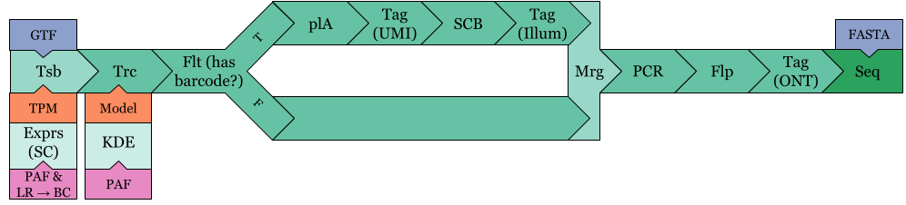

# TKSM
TKSM is a modular software for simulating long-read sequencing.
Each module is meant to simulate a specific step in the sequencing process.
The modules are designed to be piped together to form a pipeline which is specified in the configuration file.
The pipelines are executed using Snakemake.

If you are interested in the paper results, please check out the [paper branch](https://github.com/vpc-ccg/tksm/tree/paper).

## Installation

### Conda
The easiest installation method is to use [Conda](https://docs.conda.io/projects/conda/en/latest/user-guide/install/linux.html) or, much prefereblally, [Mamba](https://github.com/conda-forge/miniforge#mambaforge).
If you are using Conda, replace `mamba` with `conda` in the following commands.

Run:
```bash
mamba install -c bioconda tksm
```

### Source
To install from source, you need to have to fulfill the dependencies of TKSM.
This can be done using Mamba (or Conda) by running:

```bash
mamba create -f env.yml
mamba activate tksm
```

You may also need to install all the packages listed in the `env.yml` file manually (not recommended).

Then, you can install TKSM by running:
```bash
INSTALL_PREFIX="<install_prefix>" make -j <threads>
./install.sh
```
Where `<install_prefix>` is the path to the directory where you want to install TKSM.
For example, if you want to install TKSM in `/usr/bin`, you should run:

```bash
INSTALL_PREFIX="/usr" make -j <threads>
./install.sh
```

The `install.sh` script will copy the TKSM executable and some predefined models to the `bin` directory under the `INSTALL_PREFIX` directory.

## Running using Snakemake
Snakemake assumes that TKSM is installed in your `$PATH` and can be run by simply calling `tksm`.
You can modify the `exec` parameter in the `config.yaml` file to specify the path to the TKSM executable.

The minimum version of Snakemake required is `6v`.
To specify a simulation pipeline, modify the `config.yaml` file.

## TKSM documentation
TKSM has a number of of implemented modules.
There are four types of modules: entry-point modules, core modules, utility modules, and the exit module.

- Entry-point modules are the modules that are used to start a simulation pipeline. They generate files in the MDF format ([see below](#mdf-format)).
- Core modules are the modules that modify the molecules. They take MDF files as input and generate MDF files as output.
- Utility modules are the modules generate models that are used by specific modules (e.g. TPM for isoforms that is used by the Transcriber module).
- Exit module is the module that generates the final output of the simulation pipeline. It takes MDF files as input and generates FASTA/A files as output.


| Module/utility | Description                                           |
| -        | -                                                           |
| `KDE`    | Build truncation model                                      |
| `Badread`| Build base-level quality and error models using Badread     |
| `Exprs`  | Bulk or single-cell transcript abundance estimation         |
| `Tsb`    | Generate transcripts molecules from GTF and expression data |
| `Mrg`    | Merge output of one or more pipelines into a single MDF     |
| `plA`    | Add polyA tail to molecules                                 |
| `Trc`    | Truncate the molecules                                      |
| `Tag`    | Tag 5' or 3' end with specified FASTA pattern               |
| `Flt`    | Filter on conditions; optionally output failed molecules    |
| `PCR`    | PCR amplification                                           |
| `Glu`    | Given a random chance, glue the molecule to its successor   |
| `SCB`    | Cell barcode tagging (from tags added by Tsb module)        |
| `Flp`    | Flip the strand of the molecules with a given probability   |
| `Shf`    | Shuffle the molecules into a random order                   |
| `Seq`    | Sequence molecules into reads using Badread                 |

A TKSM pipeline is defined in the `config.yaml` file and can be composed of any number or combination of these modules.

### Configuration
The `config.yaml` file is used to specify the pipeline modules and the parameters of each module.
Check for the following example for a TKSM pipeline configuration:

```yaml
TS_experiments:
    TKSM_bulk:
        pipeline:
            - Tsb:
                params: "--molecule-count 1000000"
                model: "MCF7-sgnex"
                mode: Xpr
            - Trc:
                params: ""
                model: "MCF7-sgnex"
            - plA:
                params: "--normal=15,7.5"
            - Flp:
                params: "-p 0.5"
            - Tag:
                params: "--format5 AATGTACTTCGTTCAGTTACGTATTGCT --format3 GCAATACGTAACTGAACGAAGT"
            - Seq:
                params: "--skip-qual-compute"
                model: "MCF7-sgnex"
```
This specifies a pipeline that looks like this:
.

Note how the utilities specified implicitly by the modules that require them.
For example, the `Tsb` module requires the `Exprs` utility which will be run automatically before the `Tsb` module by Snakemake.
The `model` variable specifies a sample name that listed in the `config.yaml` file (check `samples` section of the `config.yaml` file).
The `params` variable specifies the commandline parameters that will be passed to the module ([see below](#modules)).

The pipelines can use the MDF output of other pipelines as input too using the `Mrg` module.
Here is an example of that:

```yaml
TS_experiments:
    TKSM_single_cell_head:
        pipeline:
            - Tsb:
                params: "--molecule-count 1000000"
                model: "N1"
                mode: Xpr_sc
            - Trc:
                params: ""
                model: "N1"
    TKSM_single_cell_p1:
        pipeline:
            - Mrg:
                sources: ["TKSM_single_cell_head",]
            - Flt:
                params: "-c \"info CB\""
            - plA:
                params: "--normal=15,7.5"
            - Tag: 
                params: "--format3 10"
            - SCB: 
                params: ""
            - Tag:
                params: "--format3 AGATCGGAAGAGCGTCGTGTAG"
    TKSM_single_cell_p2:
        pipeline:
            - Mrg:
                sources: ["TKSM_single_cell_head",]
            - Flt:
                params: "-c \"info CB\" --negate"
    TKSM_single_cell:
        pipeline:
            - Mrg:
                sources: ["TKSM_single_cell_p1", "TKSM_single_cell_p2"]
            - PCR:
                params: "--cycles 5 --molecule-count 5000000 -x Taq-setting1"
            - Flp:
                params: "-p 0.5"
            - Tag:
                params: "--format5 AATGTACTTCGTTCAGTTACGTATTGCT --format3 GCAATACGTAACTGAACGAAGT"
            - Seq:
                params: "--skip-qual-compute"
                model: "N1"
```

This generates the following pipeline:


Note how this experiment is actually four different pipelines;
each linear segment of the experiment is a pipeline.

### Piping
TKSM modules can be piped using [Unix pipes](https://en.wikipedia.org/wiki/Pipeline_(Unix)).
Linear pipelines can be easily pipelined using Snakemake's own `pipe()` directive.
However, for experiments with branching pipelines, we implemented our own multithreaded `cat` and `tee` scripts to enable such piping.
To enable Unix piping when running Snakemake, edit the `config.yaml` file and set the `enable_piping` variable to `true`.

Note that piping can be finicky with some Snakemake commands (e.g. dryrun `-n` gives an error).
You will also need to specify a high enough number of threads, `-j`, for Snakemake to run all the steps of the pipeline in parallel.

### MDF format

A Molecule Description Format (MDF) file is a human-readable file that describes molecules by listing for each molecule the genomic intervals it is composed of alongside custom tags describing sequence-level modifications to these intervals (e.g. substitutions).
We’ve designed MDF for TKSM inter-module communication. 

Each MDF entry (A molecule description) begins with a header line which consists of `+` symbol, followed by `<molecule_id>`, `<molecule_count>` and `<molecule_info>`.

```
+molecule_1 1 info1=1,2,3,4;info2;
```

This molecule header line is parsed by TKSM to:

```json	
{
	"Id": "molecule_1",
	"depth": 1,
	"info": {
		"info1": [1, 2, 3, 4],
		"info2": "."
    }
}
```

The header line is followed by a variable number of interval lines which are quite similar to the BED format:

```
chr	start	end	orientation	mods	comment
```

The fields are tab-separated.

- The `chr` field is the name of the contig.
- The `start` and `end` fields are the start and end positions of the interval (0-based, end-exclusive).
- The `orientation` field is the orientation of the interval (`+` or `-`).
- The `<mods>` field can be empty but the tab character preceding it is required. The `<mods>` is a list of comma separated base substitutions (no indels) local to the interval sequence represented in the current line.
The substitutions are applied to the interval sequence before the strand is flipped (if the strand is `-`).
- The `<comment>` field can be empty but the tab character preceding it is required. The `<comment>` field is used by some TKSM modules to pass meta information between them (e.g. the splicer passing cellular barcode information to the single-cell-barcoder).

For example, consider the following FASTA contig and MDF entry:
```
>1 
AGTCCCGTAA
```
```
+m1 1 
1	0	4	2C,3T
1	6	9	1G
```
Given the FASTA and MDF records, we can construct the sequence of the `m1` molecule.
First we construct the sequence of the first interval: `(chr1, 0, 4) = AGTC`.
We apply the modifications on position 2 and 3: `AGTC -> AGCC -> AGCT`.
Then we construct the second interval: `(chr1, 6, 9) = GTA`.
We apply the modification on position 1: `GTA -> GGA`.
Finally, we concatenate the two intervals to get the sequence of the `m1` molecule: `AGCTGGA`.

Note that if the contig name is not in the reference and it is a valid nucluic sequence, TKSM will use the contig name as the contig sequence.

```
>1 
AGTC
``` 
```
+m1 1 
TT	0	2
1	0	4
```
→ sequencer → 
```
>m1
TTAGTC
```

### Modules

Following are the shared arguments for each TKSM module:
```
-h, --help
--version
--verbosity [DEBUG, ERROR, INFO, OFF, WAR] 
	Sets how much information is printed by the module
--seed	
	Specifies the RNG seed (default is 42)
--log-file [file-path]
	Specifies where logs are printed (default is stderr)
```

### Utilities

#### Abundance estimation utility

#### Entry-point modules

#### Transcribing

#### Merging


### Core modules
<Preamble for common behaviour>
TKSM core modules function to modify molecule descriptions. Each of these modules are streamed if possible (Produces output as soon as possible). Common arguments of these modules are as follows:

```
-i, --input
-o, --output
```

#### Single-cell barcoding (scb)
Inserts cell barcodes from molecule info ("CB" tag) to the molecule as an interval.

```
--keep-meta-barcodes  Keep the barcodes in the mdf metadata (default 
                        behaviour is to remove them after they are
                        inserted to the sequence.)
````

```
>1
AGTCAAAAAAAAAAACTGA
```
→ 
```
+m1 1 CB:AGTCAGTC
1	0	4	
1	16	20
```
→ SCB →
```
+m1 1
AGTCAGTC 0	8
1	0	4	
1	16	20
>m1
AGTCAGTCAGCTCTGA
```

#### Tagging (tag)
```
    -5, --format5 <arg>  5' TAG format
    -3, --format3 <arg>  3' TAG format
```

Adds (tags) each input molecule with the given format sequence. -5 adds the format to the beginning of the molecules and -3 is to the end of the molecules (at least one is required). Shuffle module can be used beforehand to randomise tag placement ends.

Tag module uses the IUPAC nucleic acid notation and randomly picks one of the bases for each molecule for the ambiguous letters (not A,G, T, U, C).
Filtering (filter)
Splits the input to 2 files w.r.t. list of conditions

```
    -t, --true-output arg   output mdf file
    -f, --false-output arg  output mdf file
    -c, --condition arg 	Comma separated conditions to filter (and)
        --negate        	Negate the conjunction of the condition(s)
```

Condition syntax
Defined condition operators: [info, size, locus]

info: Check if a non-empty info tag exists in a molecule.
Example :` -c "info CB"`, checks if a molecule has CB
size: Filters molecules w.r.t their size [<, >, <=, >= , ==, !=].
Example: `-c "size >1000","size <=1500"` will select molecules with size (1000,1500].
locus: is similar to samtools view selection. Since tksm molecules can contain sequences from multiple contigs, it will accept any overlaps.
Examples:

- `-c "locus chr1"`: get molecules with sequence from chr1
- `-c "locus chr1:1000"`: get molecules that overlap with chr1 position 1000
- `-c "locus chr1:1000-1500"`: get molecules that overlap with chr1 between position 1000 and 1500.

Since in MDF, tags are considered as contigs, this module can be used to select molecules with specific tags.
`-c "locus AGATCGGAAGAGCGTCGTGTAG"` will grab molecules with that tag.

#### PCR

#### polyA tails addition

#### Strand flipping

#### Glueing

#### Shuffling

#### Truncating

### Exit module

#### Sequencing

